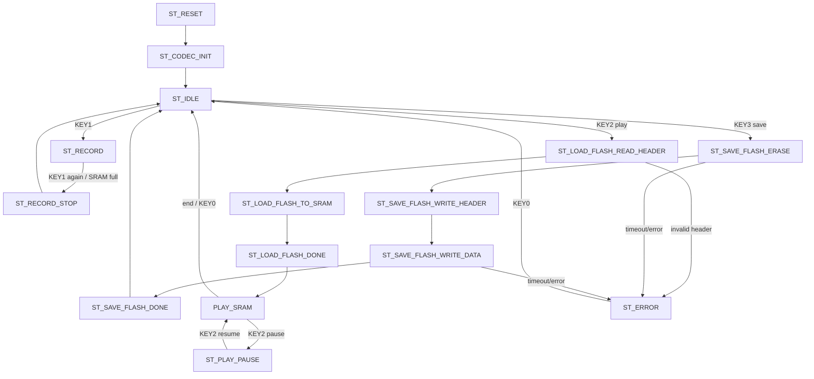
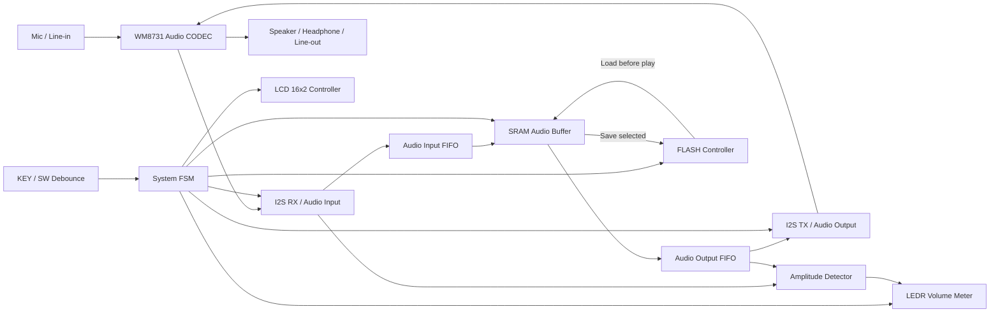

# DE2-115 聲光互動音樂播放器專案規格書

> 適用對象：Antigravity、Codex、Claude Code 或其他 AI coding agent  
> 目標：在既有 Quartus II 專案與既有 IP 基礎上，完成 DE2-115 音訊錄音、SRAM 暫存、FLASH 永久儲存、播放，以及 LEDR 聲音大小顯示功能。

---

## 0. 專案現況與重要前提

本資料夾內已經包含：

1. 已建立好的 Quartus II 初始專案。
2. 已加入或產生好的 IP / Megafunction / 範例模組。
3. 已設定完成的 top-level module。
4. 已設定完成的 DE2-115 腳位配置與 `.qsf` pin assignment。

AI coding agent 必須遵守以下規則：

- 不要重新建立新的 Quartus 專案。
- 不要任意覆蓋既有 `.qpf`、`.qsf`、`.sdc`、IP 產生檔或 top-level 檔案。
- 若需要修改 top-level，只能在既有 top module 中接線與例化新模組。
- 若需要大幅修改，必須先備份，例如 `top_backup.v`。
- 不要重新指定腳位，除非使用者明確要求。
- 優先使用專案內既有 IP 與 DE2-115 demonstration code。
- 任何新增 RTL 都應放在 `rtl/` 或專案既有 RTL 資料夾內，不要散放在根目錄。

---

## 1. 開發環境與參考路徑

### 1.1 Quartus II 路徑

本專案使用 Quartus II 13.1，安裝位置：

```text
E:\altera\13.1
```

常用執行檔可能位於：

```text
E:\altera\13.1\quartus\bin64\quartus.exe
E:\altera\13.1\quartus\bin64\quartus_sh.exe
E:\altera\13.1\quartus\bin64\quartus_map.exe
E:\altera\13.1\quartus\bin64\quartus_fit.exe
E:\altera\13.1\quartus\bin64\quartus_asm.exe
E:\altera\13.1\quartus\bin64\quartus_sta.exe
```

若系統是 32-bit Quartus 安裝，請改檢查：

```text
E:\altera\13.1\quartus\bin
```

### 1.2 DE2-115 官方範例參考路徑

請參考以下 demonstration code：

```text
F:\Universitiy\3-2\Digital_Lab\final_project\DE2-115\DE2_115_demonstrations
```

優先搜尋與參考下列類型範例：

- Audio / WM8731 / I2C / I2S 相關範例
- SRAM controller 相關範例
- FLASH controller 相關範例
- LCD 16x2 / HD44780 相關範例
- KEY / SW debounce 相關範例
- LEDR / LEDG 顯示相關範例

參考範例只作為整合依據，不要直接覆蓋目前專案的 top 與 pin assignment。

---

## 2. 專案目標

本專案為 FPGA 聲音錄製、儲存與播放系統，使用 DE2-115 板上的 WM8731 Audio CODEC 進行聲音輸入與輸出，並使用 SRAM 與 FLASH 完成暫存與永久儲存。

本版本正式顯示功能為：

> 使用 `LEDR[17:0]` 根據聲音大小顯示不同長度的音量條。  
> 音量顯示不做頻率分段，不使用外接矩陣顯示。

核心功能如下：

1. 錄音後資料先存在 SRAM。
2. 使用者選擇「儲存」後，才將 SRAM 中的音訊資料寫入 FLASH。
3. 若要播放 FLASH 中的資料，必須先將 FLASH 音訊資料載入 SRAM，再由 SRAM 播放。
4. 播放或錄音時，使用 LEDR 顯示目前聲音大小。
5. 錄音時，七段顯示器顯示目前錄製時長。
6. LCD 16x2 顯示目前模式、操作提示、錄音狀態、播放狀態與儲存狀態。
7. 八個七段顯示器顯示模式、狀態、FLASH slot、音訊輸入來源與秒數：`HEX7=MODE`、`HEX6=STAT`、`HEX5~HEX4=50~53`、`HEX3~HEX2=C1/b2`、`HEX1~HEX0=SS`。

---

## 3. 硬體資源

### 3.1 主要晶片與周邊

| 硬體 | 用途 |
|---|---|
| FPGA：Cyclone IV EP4CE115F29C7 | 系統控制、音訊資料流、記憶體控制、LED/LCD 顯示 |
| WM8731 Audio CODEC | 聲音輸入與輸出編解碼 |
| SRAM 1M x 16 bit | 錄音暫存與播放緩衝區 |
| FLASH 4M x 16 bit | 永久儲存錄音資料 |
| LCD 16x2 HD44780 | 顯示狀態與操作提示 |
| LEDR[17:0] | 顯示聲音大小音量條 |
| LEDG[8:0] | 可作狀態燈或除錯燈 |
| HEX[7:0] / SEG[7:0] | 八位七段顯示：MODE、STAT、FLASH slot、輸入來源與兩位秒數 `SS` |
| KEY[3:0] | 操作按鍵，active-low |
| SW[17:0] | 控制開關與除錯保留 |

### 3.2 音訊格式建議

| 項目 | 建議值 |
|---|---|
| 取樣率 | 目前 RTL 使用 `SAMPLE_RATE_HZ = 48000`；不由 SW 選擇 |
| 位元深度 | 16 bit |
| 聲道 | 目前錄音儲存 left channel mono，DAC 輸出複製到左右聲道 |
| 儲存單位 | 16-bit word |
| SRAM 可錄長度 | 48 kHz mono 約 21.8 秒；受 SRAM 容量與單一 FLASH slot 容量限制 |

取樣率規則：

1. 不使用 SW 切換取樣率。
2. 目前 top-level、`system_fsm`、FLASH header 與 `record_time_counter` 共用 `SAMPLE_RATE_HZ = 48000`。
3. 若未來修改 WM8731 I2C 取樣設定，必須同步修改上述參數與文件。

SRAM 容量估算：

```text
SRAM words = 1,048,576 words
48 kHz Mono = 48,000 words/s
record_time = 1,048,576 / 48,000 ≈ 21.8 s
```

若使用 Stereo，因為左右聲道都要儲存，錄音時間約減半。

---

## 4. 使用者操作定義

若目前 top-level 或報告已有既定操作方式，請優先保留；若尚未完整定義，請採用以下版本。

### 4.1 KEY 定義

| 按鍵 | 功能 |
|---|---|
| KEY0 | Reset |
| KEY1 | 開始錄音 / 停止錄音 |
| KEY2 | 播放 / 暫停 |
| KEY3 | 確認 / 儲存 / 取消，依目前 FSM 狀態決定 |

KEY 為 active-low，必須經過 debounce 與 one-pulse edge detect。

### 4.2 SW 定義

SW 不負責選擇播放來源，也不負責選擇取樣率。播放流程固定為 `FLASH -> SRAM -> Audio CODEC`，目前取樣率固定為 `SAMPLE_RATE_HZ = 48000`。

| 開關 | 功能 | 實作要求 |
|---|---|---|
| SW0 | LEDR 音量條總開關 | `0` = 關閉 LEDR 音量條，`LEDR[17:0]` 全滅；`1` = 開啟 LEDR 音量條 |
| SW1 | 保留 | 目前不接入正式主流程，不可作為取樣率或播放來源選擇 |
| SW2 | 保留 | 目前不列為正式使用者功能 |
| SW3 | FLASH 寫入保護 / 儲存允許 | `0` = 禁止寫入 FLASH，按 `KEY3` 不可執行 SRAM→FLASH；`1` = 允許按 `KEY3` 將 SRAM 儲存到 FLASH |
| SW4 | 播放循環 | `0` = 播放一次，到結尾停止；`1` = 循環播放 SRAM 中已由 FLASH 載入的音訊。即使循環播放，第一次播放前仍必須先 FLASH→SRAM |
| SW5 | 音訊輸出靜音 | `0` = 正常輸出 DAC sample；`1` = 輸出靜音，送 `16'd0` 到 DAC，但 FSM 與播放時間仍正常運作 |
| SW[7:6] | LEDR 音量靈敏度 | `00` = 1x 靈敏度，`01` = 2x 靈敏度，`10` = 4x 靈敏度，`11` = 8x 靈敏度 (放大音量條顯示) |
| SW8 | 保留 | 目前不接入正式主流程 |
| SW9 | 保留 | 目前不接入正式主流程 |
| SW[11:10] | FLASH 儲存槽選擇 | `00` = Slot 0，`01` = Slot 1，`10` = Slot 2，`11` = Slot 3 (4 個獨立 2 MiB 空間，啟動讀寫時鎖定) |
| SW[16:12] | 保留 | 不接入主功能。若需要暫時除錯，必須在註解中標明用途，完成後不得影響正式流程 |
| SW17 | 音訊輸入來源 | `0` = Line-in；`1` = Mic-in，切換時重新設定 WM8731 analog path |

### 4.3 SW 使用規則

1. `SW0` 只能控制 LEDR 音量條是否顯示，不可影響錄音、儲存、載入、播放的資料流。
2. `SW1` 目前保留，不可控制 Audio IP 取樣率或播放來源。
3. `SW2` 目前保留，不可影響正式錄音、儲存、載入與播放流程。
4. `SW3=0` 時禁止 FLASH erase / program；若使用者按 `KEY3`，LCD 應顯示 `FLASH LOCKED` 或類似提示。
5. `SW4` 不代表播放 SRAM 或播放 FLASH 的選擇；它只控制播放到結尾後是否從 SRAM 起點重新播放。
6. `SW5` 只控制 DAC 輸出 sample 是否歸零，不可暫停播放計數器與 SRAM read pointer。
7. `SW[7:6]` 只影響 LEDR 音量顯示的閾值，不改變音訊資料本身。
8. `SW8` 與 `SW9` 目前保留，不可影響正式錄音、儲存、載入與播放流程。
9. `SW17` 只切換 Line-in / Mic-in，不改變取樣率或資料流來源。

### 4.4 播放來源規則

本版本沒有 SRAM / FLASH 播放來源選擇。

- 使用者按下 KEY2 播放時，系統一律先從 FLASH 讀取 header。
- FLASH header 有效後，必須先執行 `LOAD_FLASH_TO_SRAM`，將 FLASH 音訊資料載入 SRAM。
- 載入完成後，再由 SRAM 讀出資料送到 Audio CODEC 播放。
- 不允許直接從 FLASH 串流播放。
- 不提供 SW 切換「播放 SRAM」或「播放 FLASH」的功能。
- 錄音後留在 SRAM 的暫存資料只作為儲存前緩衝，正式播放流程以 FLASH 內已儲存資料為準。

---

## 5. 儲存模式與資料流規格

本版本最重要的修改是儲存流程。

### 5.1 錄音流程

```text
Mic / Line-in
    ↓
WM8731 Audio CODEC
    ↓
I2S RX / Audio Input Interface
    ↓
Audio FIFO / Buffer
    ↓
SRAM Controller
    ↓
SRAM 暫存
```

規則：

1. 錄音時只能寫入 SRAM。
2. 錄音不直接寫入 FLASH。
3. 錄音停止後，系統記錄本次音訊長度 `record_length_words`。
4. 若 SRAM 滿，必須自動停止錄音並顯示 `SRAM FULL`。
5. 若使用者按 KEY3 確認儲存，才進入 SRAM to FLASH 流程。

### 5.2 儲存到 FLASH 流程

```text
SRAM 暫存資料
    ↓
SRAM Reader
    ↓
FLASH Writer
    ↓
FLASH 永久儲存
```

規則：

1. 只有在使用者選擇儲存後，才寫入 FLASH。
2. 寫入 FLASH 前需先 erase 目標區塊。
3. 建議在 FLASH 開頭寫入 header，用來記錄資料有效性、Audio IP 實際取樣率、資料長度與格式。
4. 寫入完成後 LCD 顯示 `SAVE DONE`。
5. 寫入失敗或超時時 LCD 顯示 `SAVE ERROR`。

### 5.3 從 FLASH 播放流程

```text
FLASH 永久儲存資料
    ↓
FLASH Reader
    ↓
SRAM Writer
    ↓
SRAM 暫存
    ↓
SRAM Reader
    ↓
I2S TX / Audio Output Interface
    ↓
WM8731 Audio CODEC
    ↓
Speaker / Headphone / Line-out
```

規則：

1. 要聽 FLASH 內容時，必須先把 FLASH 載入 SRAM。
2. 載入完成後，播放來源實際上仍是 SRAM。
3. 不實作 FLASH 直接串流播放，避免 FLASH 讀取時序與 Audio streaming timing 互相干擾。
4. 若 FLASH header 無效，LCD 顯示 `NO FLASH DATA`。
5. 若 FLASH 載入成功，LCD 顯示 `LOAD DONE`，接著可播放。

---

## 6. 建議 FLASH Header 格式

FLASH 位址 0 開始可放置音訊 header。資料區從固定 offset 開始，例如 `FLASH_AUDIO_BASE = 16'h0010` 或依實際 FLASH controller address width 調整。

| Word Offset | 欄位 | 說明 |
|---:|---|---|
| 0 | MAGIC | 固定值，例如 `16'hA55A`，表示 FLASH 內有有效音訊 |
| 1 | VERSION | 格式版本，例如 `16'h0001` |
| 2 | SAMPLE_RATE | 目前寫入 `48000`，必須與 `SAMPLE_RATE_HZ` 一致 |
| 3 | FORMAT | bit[0]：0=Mono，1=Stereo；bit[1]：0=Signed PCM，1=Unsigned PCM |
| 4 | LENGTH_LO | 音訊資料 word 數低 16 bit |
| 5 | LENGTH_HI | 音訊資料 word 數高 16 bit |
| 6 | CHECKSUM_LO | 可選，簡易 checksum 低 16 bit |
| 7 | CHECKSUM_HI | 可選，簡易 checksum 高 16 bit |
| 8~15 | RESERVED | 保留 |
| 16~ | AUDIO_DATA | 16-bit PCM 音訊資料 |

v1 若時間不足，可先不做 checksum，但至少要有 MAGIC 與 LENGTH。

---

## 7. 系統狀態機設計

### 7.1 Main FSM 狀態

| 狀態 | 說明 |
|---|---|
| `ST_RESET` | 系統重置，清除暫存狀態 |
| `ST_CODEC_INIT` | 初始化 WM8731 codec，設定 I2C register |
| `ST_IDLE` | 主選單 / 等待操作 |
| `ST_RECORD` | 錄音，Audio input 寫入 SRAM |
| `ST_RECORD_STOP` | 停止錄音，鎖定 `record_length_words` |
| `ST_PLAY_SRAM` | FLASH 載入 SRAM 後，從 SRAM 讀出並播放 |
| `ST_PLAY_PAUSE` | 播放暫停 |
| `ST_SAVE_FLASH_ERASE` | FLASH erase |
| `ST_SAVE_FLASH_WRITE_HEADER` | 寫入 FLASH header |
| `ST_SAVE_FLASH_WRITE_DATA` | SRAM 複製到 FLASH |
| `ST_SAVE_FLASH_DONE` | 儲存完成 |
| `ST_LOAD_FLASH_READ_HEADER` | 讀取 FLASH header |
| `ST_LOAD_FLASH_TO_SRAM` | FLASH 複製到 SRAM |
| `ST_LOAD_FLASH_DONE` | 載入完成，接著進入 SRAM 播放 |
| `ST_ERROR` | 錯誤狀態 |

### 7.2 Main FSM 操作流程



---

## 8. 系統方塊架構

本版本架構以 SRAM 作為所有錄音與播放的主要音訊 buffer，FLASH 只作為永久儲存媒介。



---

## 9. 模組職責

目前主要檔名如下，詳細維護說明以 `MODULE_REFERENCE.md` 為準。

| 模組 | 職責 |
|---|---|
| `rtl/audio_spectrum_top.v` | Top-level `AudioSpectrum_FPGA`，保留腳位，負責例化所有子模組 |
| `system_fsm.v` | 主狀態機，控制錄音、播放、儲存、載入、LCD 狀態 |
| `flash_controller.v` | 低階 FLASH erase / program / read 控制 |
| `key_debounce.v` | KEY 防彈跳 |
| `one_pulse.v` | 將按鍵轉成單週期 pulse |
| `I2C_AV_Config.v` | I2C 設定 WM8731 registers，支援 `SW17` 切換 line-in / mic-in |
| `audio_adc_aligned.v` | 接收 WM8731 ADC serial data，輸出 32-bit stereo sample |
| `audio_dac_aligned.v` | 將 32-bit host sample 序列化輸出至 WM8731 DAC |
| `audio_fifo.v` | Terasic async FIFO，用於 audio ADC/DAC wrapper |
| `ledr_volume_meter.v` | 根據音訊振幅控制 LEDR 顯示長度 |
| `lcd_status_controller.v` | 顯示目前狀態與提示文字 |
| `record_time_counter.v` | 根據 codec sample tick 與 `SAMPLE_RATE_HZ` 計算錄音與播放秒數 |
| `sevenseg_decoder.v` | 將 BCD 數字轉成七段顯示器輸出 |
| `hex_status_timer_display.v` | 控制 8 個七段顯示器：MODE、STAT、FLASH slot、輸入來源與秒數 `SS` |

若既有 IP 名稱不同，請使用 adapter/wrapper 包裝，不要直接大改 IP 內部。

---

## 10. LEDR 聲音大小顯示規格

### 10.1 功能取代

本版本的聲音顯示資料流固定為：

```text
Audio sample → Amplitude Detector → LEDR Volume Meter → LEDR[17:0]
```

顯示功能只根據音訊振幅大小控制 LEDR 亮燈長度，不做頻率分段分析。若原專案已有其他矩陣顯示相關檔案，請保留在資料夾中，但不要接入主資料流。

### 10.2 音量條顯示邏輯

輸入音訊為 16-bit signed PCM 時，先取絕對值：

```verilog
wire [15:0] abs_sample;
assign abs_sample = sample_in[15] ? (~sample_in + 16'd1) : sample_in;
```

將振幅對應到 0~18 顆紅燈：

```text
bars = abs_sample * 18 / 32768
```

LEDR 顯示方式：

| bars | LEDR 顯示 |
|---:|---|
| 0 | 全暗 |
| 1 | LEDR[0] 亮 |
| 2 | LEDR[1:0] 亮 |
| ... | ... |
| 18 | LEDR[17:0] 全亮 |

建議加入簡單平滑，避免 LED 抖動太嚴重：

```text
smooth_amp = smooth_amp - (smooth_amp >> 3) + (abs_sample >> 3)
bars = smooth_amp * 18 / 32768
```

### 10.3 LEDR 模組介面建議

```verilog
module ledr_volume_meter (
    input  wire        clk,
    input  wire        rst_n,
    input  wire        sample_valid,
    input  wire signed [15:0] sample_in,
    input  wire        smooth_en,
    output reg  [17:0] ledr
);
```

注意事項：

- `sample_valid` 只在有新 sample 時為 1。
- 若播放中，建議用播放輸出的 sample 顯示音量。
- 若錄音中，建議用錄音輸入的 sample 顯示音量。
- 若 idle，可清空 LEDR 或保留最後狀態，建議清空。

---

## 11. LCD 與 SEG 顯示規格

本專案必須明確規範 LCD 與八個七段顯示器的內容，避免 Antigravity / Codex 自行猜測顯示格式。

### 11.1 顯示器命名規則

DE2-115 板上共有 8 個七段顯示器，Quartus top-level 常見命名為 `HEX7~HEX0`。本文件中的 `SEG` 與 `HEX` 對應如下：

```text
SEG7 SEG6 SEG5 SEG4 SEG3 SEG2 SEG1 SEG0
 =   =    =    =    =    =    =    =
HEX7 HEX6 HEX5 HEX4 HEX3 HEX2 HEX1 HEX0
```

七段顯示器採用目前 RTL 的固定欄位配置：

```text
HEX7 | HEX6 | HEX5 HEX4 | HEX3 HEX2 | HEX1 HEX0
MODE | STAT | FLASH SLOT | INPUT SOURCE | SECONDS
```

若專案內七段顯示器為 active-low，必須使用既有 `sevenseg_decoder` 或新增 decoder 轉換，不可直接輸出 BCD 到 HEX port。

---

### 11.2 SEG / HEX 顯示定義

#### 11.2.1 HEX7：系統模式代碼 MODE

| HEX7 | 系統模式 | 對應 FSM 狀態 |
|---:|---|---|
| `0` | Idle / 主選單 | `ST_IDLE` |
| `1` | Recording / 錄音中 | `ST_RECORD` |
| `2` | Record Stop / 錄音停止 | `ST_RECORD_STOP` |
| `3` | Save Flash / 儲存到 FLASH | `ST_SAVE_FLASH_*` |
| `4` | Load Flash / FLASH 載入 SRAM | `ST_LOAD_FLASH_*` |
| `5` | Play / 播放中 | `ST_PLAY_SRAM` |
| `6` | Pause / 播放暫停 | `ST_PLAY_PAUSE` |
| `7` | Init / 初始化 | `ST_RESET`, `ST_CODEC_INIT` |
| `9` | Error / 錯誤 | `ST_ERROR` |

`system_fsm` 仍輸出兩位 BCD `mode_code`，但目前 `hex_status_timer_display` 只顯示 ones digit。

#### 11.2.2 HEX6：狀態代碼 STAT

| HEX6 | 狀態意義 | 使用情境 |
|---:|---|---|
| `0` | Ready | Idle、等待操作 |
| `1` | Busy | 錄音中、播放中、儲存中、載入中 |
| `2` | Done | 錄音停止、儲存完成、載入完成 |
| `3` | SRAM Full | SRAM 錄音空間已滿 |
| `4` | No Flash Data | FLASH header 無效或沒有資料 |
| `5` | Flash Error | FLASH erase / write / read 失敗 |
| `7` | Timeout | 記憶體操作逾時 |
| `8` | Pause | 播放暫停 |
| `9` | Wait | 初始化或等待硬體 ready |

`system_fsm` 仍輸出兩位 BCD `status_code`，但目前 `hex_status_timer_display` 只顯示 ones digit。

#### 11.2.3 HEX5~HEX4：FLASH Slot

`HEX5~HEX4` 顯示目前 `SW[11:10]` 選到的 FLASH slot。`HEX5` 以七段數字 `5` 代表 `S`，因此顯示為 `50`、`51`、`52`、`53`，分別代表 Slot 0~3。

#### 11.2.4 HEX3~HEX2：輸入來源

`HEX3~HEX2` 顯示 `SW17` 選到的音訊輸入來源：

| SW17 | HEX3~HEX2 | 意義 |
|---:|---|---|
| `0` | `C1` | Line-in / cable input |
| `1` | `b2` | Mic-in / board mic input |

#### 11.2.5 HEX1~HEX0：時間欄位 TIME

`HEX1~HEX0` 顯示兩位秒數 `SS`。

```text
HEX1 HEX0 = 秒十位 秒個位
例如：00、01、15、21、59
```

時間顯示規則：

1. 錄音中：顯示目前錄製時長。
2. 錄音停止：保留最後錄音時長。
3. 儲存 FLASH：保留本次錄音時長。
4. 載入 FLASH：若 header 已讀到音訊長度，可顯示 FLASH 音訊總秒數 `SS`；尚未讀到時顯示 `00`。
5. 播放中：只顯示目前播放經過秒數 `SS`，不可顯示分鐘或四位時間格式。
6. 播放暫停：保留暫停當下播放時間。
7. 錯誤狀態：保留最後秒數，或依錯誤來源顯示 `00`。

若時間超過 59 秒，七段顯示器固定飽和在 `59`，不要 overflow 變成 `60` 或其他錯誤數字。

---

### 11.3 各 FSM 狀態的 SEG 顯示表

| FSM 狀態 | HEX7 MODE | HEX6 STAT | HEX5~HEX4 SLOT | HEX3~HEX2 INPUT | HEX1~HEX0 TIME |
|---|---:|---:|---|---|---|
| `ST_RESET` | `7` | `9` | `50`~`53` | `C1`/`b2` | `00` |
| `ST_CODEC_INIT` | `7` | `9` | `50`~`53` | `C1`/`b2` | `00` |
| `ST_IDLE` | `0` | `0` | `50`~`53` | `C1`/`b2` | 上次錄音秒數，無資料則 `00` |
| `ST_RECORD` | `1` | `1` | `50`~`53` | `C1`/`b2` | 錄音秒數 `SS` |
| `ST_RECORD_STOP` | `2` | `2` 或 `3` | `50`~`53` | `C1`/`b2` | 本次錄音長度 `SS` |
| `ST_SAVE_FLASH_*` | `3` | `1` | `50`~`53` | `C1`/`b2` | 本次錄音長度 `SS` |
| `ST_SAVE_FLASH_DONE` | `3` | `2` | `50`~`53` | `C1`/`b2` | 本次錄音長度 `SS` |
| `ST_LOAD_FLASH_*` | `4` | `1` | `50`~`53` | `C1`/`b2` | `00` 或 FLASH 音訊秒數 |
| `ST_LOAD_FLASH_DONE` | `4` | `2` | `50`~`53` | `C1`/`b2` | FLASH 音訊秒數 |
| `ST_PLAY_SRAM` | `5` | `1` | `50`~`53` | `C1`/`b2` | 播放經過秒數 `SS` |
| `ST_PLAY_PAUSE` | `6` | `8` | `50`~`53` | `C1`/`b2` | 暫停當下播放秒數 `SS` |
| `ST_ERROR` | `9` | 錯誤代碼 ones digit | `50`~`53` | `C1`/`b2` | 最後秒數或 `00` |

---

### 11.4 錄音與播放秒數計算方式

錄音秒數必須根據實際寫入 SRAM 的 sample 數與 Audio IP 取樣率計算，不使用 SW 選擇取樣率。

```text
record_seconds = recorded_sample_count / SAMPLE_RATE_HZ
play_seconds   = played_sample_count   / SAMPLE_RATE_HZ

record_display_seconds = min(record_seconds, 59)
play_display_seconds   = min(play_seconds, 59)
```

目前 `SAMPLE_RATE_HZ` 固定為 `48000`，並由 top-level 傳給 `system_fsm` 與 `record_time_counter`。

---

### 11.5 SEG 顯示模組介面建議

```verilog
module record_time_counter #(
    parameter SAMPLE_RATE_HZ = 48000
)(
    input  wire        clk,
    input  wire        rst_n,
    input  wire        record_active,
    input  wire        play_active,
    input  wire        record_sample_tick,
    input  wire        play_sample_tick,
    input  wire        clear_record_time,
    input  wire        clear_play_time,
    output reg  [6:0]  record_seconds,
    output reg  [6:0]  play_seconds
);
```

```verilog
module hex_status_timer_display (
    input  wire [7:0]  mode_code_bcd,
    input  wire [7:0]  status_code_bcd,
    input  wire [6:0]  time_seconds,
    input  wire [1:0]  flash_slot,
    input  wire        sw_input_source,
    output wire [6:0]  HEX0, HEX1, HEX2, HEX3,
    output wire [6:0]  HEX4, HEX5, HEX6, HEX7
);
```

`mode_code_bcd` 與 `status_code_bcd` 由 `system_fsm` 產生；slot 與輸入來源直接來自 `SW[11:10]` 與 `SW17`。

---

### 11.6 LCD 16x2 顯示規格

LCD 使用 16x2 字元顯示，建議只使用 ASCII 英文與數字，避免 HD44780 字型不支援中文。每行不足 16 字元時由 LCD controller 自動補空白。

| FSM / 事件 | LCD 第一行 | LCD 第二行 | 說明 |
|---|---|---|---|
| `ST_RESET` | `SYSTEM RESET` | `PLEASE WAIT` | 系統重置 |
| `ST_CODEC_INIT` | `CODEC INIT` | `PLEASE WAIT` | WM8731 初始化中 |
| `ST_IDLE` | `AUDIO: LINE-IN` 或 `AUDIO: MIC-IN` | `K1 REC K2 LOAD` | 主畫面，顯示目前輸入來源 |
| `ST_RECORD` | `REC: LINE-IN` 或 `REC: MIC-IN` | `T=SSs SRAM` | 錄音中，秒數要即時更新，例如 `T=15s SRAM` |
| `ST_RECORD_STOP` | `REC DONE SSs` | `REC:1 PL:2 SAV:3` 或 `SW3 UNLK TO SAVE` | 錄音停止，可選擇重新錄音、播放或儲存 |
| `ST_SAVE_FLASH_ERASE` | `ERASE FLASH` | `PLEASE WAIT` | FLASH erase 中 |
| `ST_SAVE_FLASH_WRITE_HEADER` | `SAVING FLASH` | `WRITE HEADER` | 寫入 header |
| `ST_SAVE_FLASH_WRITE_DATA` | `SAVING FLASH` | `SRAM->FLASH` | SRAM 資料寫入 FLASH |
| `ST_SAVE_FLASH_DONE` | `SAVE DONE` | `DATA IN FLASH` | 儲存完成 |
| `ST_LOAD_FLASH_READ_HEADER` | `CHECK FLASH` | `READ HEADER` | 播放前檢查 FLASH header |
| `ST_LOAD_FLASH_TO_SRAM` | `LOADING FLASH` | `FLASH->SRAM` | 播放前固定先載入 SRAM |
| `ST_LOAD_FLASH_DONE` | `LOAD DONE` | `PLAY FROM SRAM` | 載入完成，接著由 SRAM 播放 |
| `ST_PLAY_SRAM` | `PLAYING AUDIO` | `T=SSs SRAM` | 播放中，只顯示兩位秒數，例如 `T=15s SRAM` |
| `ST_PLAY_PAUSE` | `PLAY PAUSE` | `K2 RESUME` | 暫停播放 |
| SRAM full | `SRAM FULL` | `REC STOP` | SRAM 已滿，自動停止錄音 |
| No flash data | `NO FLASH DATA` | `K1 REC FIRST` | FLASH 沒有有效資料 |
| Save error | `SAVE ERROR` | `CHECK FLASH` | FLASH 儲存失敗 |
| Load error | `LOAD ERROR` | `CHECK FLASH` | FLASH 載入失敗 |
| `ST_ERROR` | `ERROR` | `CHECK MEMORY` | 一般錯誤 |

LCD 顯示優先權：

1. 錯誤訊息優先於一般狀態。
2. 記憶體操作中顯示 `PLEASE WAIT` 或資料流方向。
3. 錄音與播放時，LCD 第二行的秒數 `SS` 必須與 SEG 的 `HEX1~HEX0` 同步。
4. LCD 不負責顯示音量，音量只由 `LEDR[17:0]` 顯示。

### 11.7 LCD 模組介面建議

```verilog
module lcd_status_controller (
    input  wire        clk,
    input  wire        rst_n,
    input  wire [3:0]  fsm_state,
    input  wire [6:0]  record_seconds,
    input  wire [6:0]  play_seconds,
    input  wire        sram_full,
    input  wire        flash_error,
    input  wire        flash_header_valid,
    input  wire        sw_input_source,
    input  wire        sw_flash_unlock,
    output wire [7:0]  LCD_DATA,
    output wire        LCD_RW,
    output wire        LCD_EN,
    output wire        LCD_RS
);
```

若既有 LCD IP 介面不同，請新增 wrapper 轉接，不要大幅改動既有 IP。

## 12. 目前資料夾結構

目前專案採用以下結構：

```text
antigravity_version/
├── README.md
├── DE2_115_AUDIO_SPEC.md
├── MODULE_REFERENCE.md
├── LICENSE
├── quartus/
│   ├── AudioSpectrum_FPGA.qpf
│   ├── AudioSpectrum_FPGA.qsf
│   ├── AudioSpectrum_FPGA.sdc
│   └── AudioSpectrum_FPGA.pof
├── rtl/
│   ├── audio_spectrum_top.v
│   ├── system/
│   │   ├── system_fsm.v
│   │   ├── flash_controller.v
│   │   ├── key_debounce.v
│   │   ├── one_pulse.v
│   │   └── flash_test_top.v
│   ├── audio/
│   │   ├── audio_adc_aligned.v
│   │   └── audio_dac_aligned.v
│   ├── display/
│   │   ├── ledr_volume_meter.v
│   │   ├── lcd_status_controller.v
│   │   ├── record_time_counter.v
│   │   ├── sevenseg_decoder.v
│   │   └── hex_status_timer_display.v
├── ip/
│   ├── terasic_audio/
│   ├── terasic_clock/
│   ├── terasic_i2c/
│   ├── terasic_lcd/
│   ├── terasic_seg7/
│   └── terasic_sram/
├── sim/
│   ├── tb_system_fsm.v
│   ├── tb_ledr_volume_meter.v
│   ├── tb_hex_status_timer_display.v
│   └── tb_flash_test.v
└── doc/
    └── Proposal/
```

---

## 13. Top-level 整合注意事項

### 13.1 必須保留的 DE2-115 介面

實際 port 名稱以既有 top-level 為準，常見名稱如下：

```verilog
input         CLOCK_50;
input  [3:0]  KEY;
input  [17:0] SW;
output [17:0] LEDR;
output [8:0]  LEDG;
output [6:0]  HEX0;
output [6:0]  HEX1;
output [6:0]  HEX2;
output [6:0]  HEX3;
output [6:0]  HEX4;
output [6:0]  HEX5;
output [6:0]  HEX6;
output [6:0]  HEX7;

// Audio CODEC
input         AUD_ADCDAT;
inout         AUD_ADCLRCK;
inout         AUD_BCLK;
output        AUD_DACDAT;
inout         AUD_DACLRCK;
output        AUD_XCK;

// I2C for WM8731
inout         I2C_SDAT;
output        I2C_SCLK;

// SRAM
output [19:0] SRAM_ADDR;
inout  [15:0] SRAM_DQ;
output        SRAM_CE_N;
output        SRAM_OE_N;
output        SRAM_WE_N;
output        SRAM_UB_N;
output        SRAM_LB_N;

// FLASH
output [22:0] FL_ADDR;
inout  [15:0] FL_DQ;
output        FL_CE_N;
output        FL_OE_N;
output        FL_WE_N;
output        FL_RST_N;

// LCD
output        LCD_ON;
output        LCD_BLON;
output        LCD_EN;
output        LCD_RS;
output        LCD_RW;
inout  [7:0]  LCD_DATA;
```

如果既有 top 使用不同命名，不要強行改名；請在內部 wire adapter 對應。

### 13.2 不要修改腳位配置

因為 `.qsf` 已經設定完成腳位，因此 agent 不應重新建立 pin assignment。若編譯出現 port 找不到，應先檢查 top module port 名稱是否與 `.qsf` 相符，而不是直接刪除 `.qsf` 設定。

---

## 14. 實作順序建議

### Step 1：盤點現有專案

1. 找出 `.qpf` 專案名稱。
2. 找出 top-level module 名稱。
3. 找出目前已存在的 audio、SRAM、FLASH、LCD、FIFO IP。
4. 找出目前 `.qsf` 指定的 top entity。
5. 不修改任何檔案，先整理現況。

### Step 2：建立 LEDR 音量顯示主功能

1. 確認 top-level 的 `LEDR[17:0]` 已正確接到輸出腳位。
2. 新增或整合 `ledr_volume_meter.v`。
3. 將錄音輸入 sample 或播放輸出 sample 接到 `ledr_volume_meter.v`。
4. 確認主資料流的顯示輸出只使用 LEDR 音量條。

### Step 3：完成 Audio path

1. 確認 WM8731 I2C 初始化可運作。
2. 確認 I2S RX 能取得 16-bit sample。
3. 確認 I2S TX 能播放 16-bit sample。
4. 若左右聲道都存在，v1 可只取 Left channel 或轉 Mono。

### Step 4：完成 SRAM record/playback

1. 錄音時從 audio input 寫入 SRAM。
2. 停止錄音時記錄 `record_length_words`。
3. 播放時從 SRAM address 0 開始讀出。
4. 讀到 `record_length_words` 結束播放。

### Step 5：完成 SRAM to FLASH save

1. KEY3 觸發 save。
2. FLASH erase。
3. 寫入 header。
4. 從 SRAM 依序讀出資料並寫入 FLASH。
5. 完成後顯示 `SAVE DONE`。

### Step 6：完成 FLASH to SRAM load

1. 按下 KEY2 播放時，一律先讀取 FLASH header。
2. header 有效後，依照 length 把 FLASH 資料載入 SRAM。
3. 載入完成後再從 SRAM 播放。
4. 不使用 SW 選擇 SRAM 或 FLASH 播放來源。

### Step 7：完成 LEDR volume meter

1. 錄音時以 input sample 顯示音量。
2. 播放時以 output sample 顯示音量。
3. idle 時 LEDR 清空。
4. 確認聲音越大，LEDR 亮的顆數越多。

### Step 8：完成 SEG 八位七段顯示

1. 錄音開始時清除 `record_seconds`。
2. 播放開始時清除 `play_seconds`。
3. 錄音中根據 `sample_valid` 與 Audio IP 實際取樣率累加錄音秒數。
4. 播放中根據輸出 sample 計算播放秒數。
5. 8 個七段顯示器固定採用目前 RTL 配置：`HEX7 = MODE`、`HEX6 = STAT`、`HEX5~HEX4 = FLASH slot`、`HEX3~HEX2 = input source`、`HEX1~HEX0 = SS`。
6. 錄音停止、儲存、載入與暫停狀態必須依第 11 節顯示對應內容。

### Step 9：完成 LCD 狀態顯示

1. LCD 必須依第 11.6 節的 16x2 顯示表實作。
2. 錄音與播放時，LCD 第二行的秒數 `SS` 必須與 SEG 的 `HEX1~HEX0` 同步。
3. 載入流程必須顯示 `FLASH->SRAM`，因為播放固定先從 FLASH 載入 SRAM。
4. 錯誤訊息優先顯示，例如 `NO FLASH DATA`、`SAVE ERROR`、`LOAD ERROR`。

---

## 15. Quartus 編譯指令

請先確認專案名稱，例如 `<project_name>.qpf`。使用 command line 編譯時可執行：

```bat
"E:\altera\13.1\quartus\bin64\quartus_sh.exe" --flow compile <project_name>
```

若沒有 `bin64`，改用：

```bat
"E:\altera\13.1\quartus\bin\quartus_sh.exe" --flow compile <project_name>
```

GUI 開啟方式：

```bat
"E:\altera\13.1\quartus\bin64\quartus.exe" <project_name>.qpf
```

或：

```bat
"E:\altera\13.1\quartus\bin\quartus.exe" <project_name>.qpf
```

---

## 16. 模擬與測試計畫

### 16.1 單元測試

| 測試 | 目標 |
|---|---|
| `tb_ledr_volume_meter.v` | 輸入不同振幅 sample，檢查 LEDR 長度是否正確 |
| `tb_system_fsm.v` | KEY/SW 操作後狀態是否正確轉移 |
| `tb_hex_status_timer_display.v` | 檢查 MODE、STAT、FLASH slot、輸入來源與秒數的 HEX 位置 |
| `tb_flash_test.v` | 舊版 FLASH 格式測試；部分環境可能 timeout |

### 16.2 硬體測試流程

1. 上電後 LCD 顯示 `AUDIO: LINE-IN` 或 `AUDIO: MIC-IN`，SEG 顯示 mode/status、slot、輸入來源與秒數。
2. 按 KEY1 錄音，對 Mic / Line-in 輸入聲音。
3. 錄音中確認 LEDR 會隨聲音大小變化。
4. 錄音中確認 SEG 顯示 `MODE=1`、`STAT=1`、目前 slot、輸入來源與秒數 `SS`。
5. 錄音中確認 LCD 顯示 `RECORDING`，第二行顯示 `T=SSs SRAM`。
6. 再按 KEY1 停止錄音，確認 LCD 顯示 `REC DONE SSs`，SEG 顯示 `MODE=2`、`STAT=2` 與錄音秒數。
7. 按 KEY3，確認 LCD 顯示 `SAVING FLASH` / `SRAM->FLASH`，SEG 顯示 `MODE=3`、`STAT=1`，完成後顯示 `SAVE DONE` 與 `MODE=3`、`STAT=2`。
8. Reset 系統。
9. 按 KEY2 播放，系統應先顯示 `LOADING FLASH` / `FLASH->SRAM`，SEG 顯示 `MODE=4`、`STAT=1`。
10. 載入完成後，從 SRAM 播放 FLASH 內容，LCD 顯示 `PLAYING AUDIO`，SEG 顯示 `MODE=5`、`STAT=1` 與播放秒數。
11. 確認沒有 SW0 播放來源選擇，也不會直接從 FLASH 串流播放。
12. 測試 `SW0=0` 時 LEDR 全滅，`SW0=1` 時 LEDR 依音量顯示。
13. 確認 `SW1` 與 `SW2` 目前不影響正式主流程。
14. 測試 `SW3=0` 時禁止 SRAM→FLASH，`SW3=1` 時才允許按 `KEY3` 儲存。
15. 測試 `SW4=1` 時播放到結尾後可從 SRAM 起點循環播放，但首次播放前仍必須先完成 FLASH→SRAM。
16. 測試 `SW5=1` 時 DAC 輸出靜音，但播放秒數與 read pointer 仍繼續前進。
17. 測試 `SW[7:6]` 可改變 LEDR 音量條靈敏度。

---

## 17. 驗收條件

本專案完成後至少要符合以下條件：

- Quartus II 13.1 可完整 compile。
- 不破壞既有 top-level port 與 pin assignment。
- WM8731 可完成初始化。
- 錄音資料會先寫入 SRAM。
- 錄音停止後不會自動寫入 FLASH。
- 使用者按下儲存後，才會將 SRAM 資料寫入 FLASH。
- 播放時沒有 SRAM / FLASH 來源選擇。
- 播放一定要先載入 FLASH 到 SRAM，再從 SRAM buffer 播放。
- SW0 不可作為播放來源選擇，SW1 不可作為取樣率選擇。
- SW0、SW3、SW4、SW5、SW[7:6]、SW[11:10]、SW17 必須依第 4.2 節定義實作；保留開關不得影響正式流程。
- SW3 必須能保護 FLASH，避免未允許時誤寫入 FLASH。
- LEDR[17:0] 會依照聲音大小顯示不同長度。
- 八個七段顯示器依目前 RTL 配置顯示 MODE、STAT、FLASH slot、輸入來源與秒數 `SS`。
- 錄音時 SEG 顯示 `MODE=1`、`STAT=1`，且 `SS` 為錄製秒數。
- 主流程使用 LEDR Volume Meter 作為聲音大小顯示輸出。
- LCD 能顯示主要狀態。
- 若 FLASH 無有效資料，系統能顯示錯誤或提示，而不是播放亂碼。

---

## 18. 明確不做的功能

以下功能不列為本版本必要功能：

- 頻率分段分析。
- 外接矩陣顯示 顯示。
- MP3 / WAV 檔案格式解析。
- 音訊壓縮。
- 從 FLASH 直接串流播放。
- 使用 SW 選擇播放 SRAM 或 FLASH。
- 使用 SW 選擇取樣率。
- 多段錄音管理。
- 檔案系統。
- SD card。
- Nios II 軟體控制。

若專案內已存在上述模組，可以保留，但不應作為主要功能依賴。

---

## 19. Agent 修改原則

Antigravity / Codex 執行時請遵守：

1. 先讀取現有專案，不要直接重構。
2. 先找出 top entity 與 pin assignment。
3. 先找出現有 IP 名稱與介面。
4. 新增 wrapper 比直接修改 IP 更安全。
5. 若現有模組能用，優先接線整合，不要重寫。
6. 修改 top 前先備份。
7. 每完成一個階段就 compile 一次。
8. 發現缺少 IP 或範例檔時，先在 demonstration path 搜尋。
9. 顯示功能維持 LEDR 音量條，不新增頻率分段分析。
10. 不要直接從 FLASH 播放；必須 FLASH → SRAM → playback。
11. 不要加入 SRAM / FLASH 播放來源選擇。
12. 不要使用 SW 切換取樣率；目前 `SAMPLE_RATE_HZ` 固定為 `48000`，若修改 WM8731 設定需同步更新 RTL 參數與文件。
13. 錄音時必須保留 HEX 錄製時長顯示。

---

## 20. 建議交付結果

完成後資料夾應包含：

```text
1. 可編譯的 Quartus II 13.1 專案
2. 保留原本 top 與 pin assignment 的整合版 RTL
3. 新增或整理後的 system / audio / display 模組
4. LEDR 音量條功能
5. SEG 八位七段顯示功能，顯示 MODE / STAT / FLASH slot / input source / TIME
6. SRAM record buffer 功能
7. SRAM to FLASH save 功能
8. FLASH to SRAM load 後播放功能
9. LCD 狀態顯示
10. 簡易 testbench 或硬體測試紀錄
11. README 或本規格文件
```

---

## 21. 一句話總結

本專案是以 SRAM 為錄音暫存與播放 buffer、FLASH 為永久儲存、播放前必須 FLASH 載入 SRAM、LEDR 為音量條顯示、SEG/HEX 八位七段顯示器顯示 MODE / STAT / FLASH slot / input source / TIME、LCD 顯示完整操作狀態的 DE2-115 FPGA 錄音播放系統。
